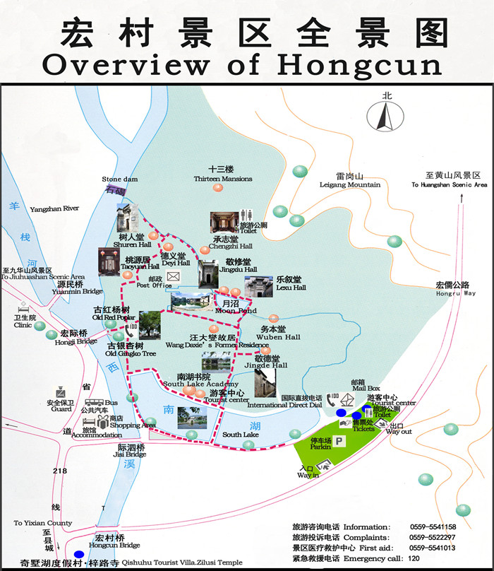

# 宏村

宏村位于“桃花源里人家”-黟县东北部，距黟县县城11km，村落面积19.17公顷，现存明清时期古建筑138幢。宏村始建于南宋绍兴年间（公元1131年），取名“弘村”，清乾隆年间避帝讳改为“宏村”，取宏广发达之意，至今已有800多年的历史，为汪姓聚居之地。

宏村已被列入全国重点文物保护单位、全国首批历史文化名村、全国5A级旅游区。

2000年11月30日，第24界世界遗产委员会在澳大利亚凯恩斯召开，联合国教科文组织遗产委员会国际古遗迹理事会专家大河直躬博士评价宏村为：“古老文明的见证、传统建筑的典型作品、人与自然结合的光辉典范”。

宏村的选址、布局，宏村的美景都和水有着直接的关系。

宏村被誉为“中国画里的乡村”，联合国专家称赞它为“举世无双的小城镇水街景观”。因为它背倚黄山余脉羊栈岭、雷岗山，地势较高，有时云蒸霞蔚，如浓墨重彩，有时似泼墨写意，四周山色与粉墙青瓦倒映湖中，人、古建筑与大自然融为一体，好似一幅徐徐展开的山水画卷。

水在宏村的选址中作用重大。相传宏村的汪氏祖先先后在歙县唐模、黟县奇墅湖村居住，但屡次遭遇火灾。后来汪氏举家迁到雷岗山下，最初建十三楼。鉴于以往教训，宏村在规划时十分注重人工水系的安排，提高预防火灾的能力，后历经400余年、多少代人的努力，特别是明永乐年间宏村76世祖汪思齐请风水先生勘定环境，对建筑重新布局，宏村的设计、构造最终实现。

在村落的科学布局中，非常注重水系的安排。整个村落采用仿生学的“牛”形布局，以雷岗山为牛头，村口的两株古树为牛角，月沼为牛胃，南湖为牛肚，蜿蜒的水圳为牛肠，民居建筑为牛身，四座古桥为牛脚，称作“山为牛头树为角，桥为四蹄屋为身”，形状惟妙惟肖，整个村落就像一头悠闲的水牛静卧在青山绿水之中。

宏村有着一套完善的供水系统，水系设计科学又别出心裁。村民们将村西的河水引入村内，开凿了一条近1米宽的水圳，九曲十弯，为各家各户提供生活用水，同时也起到调节气温和美化环境等作用。水圳在村的中部形成半月形的月沼，又在南部形成弓形的南湖，构成了宏村独特的风貌。村内外人工水系规划，体现了人类巧用自然资源的智慧，可以说是节约型社会利用可再生资源的典范。

水在村内建筑中也不可或缺。宏村建筑主要是住宅和私家园林，也有书院和祠堂等公共设施，建筑组群完整。村内街巷傍水而建，民居也都围绕着月沼布局，住宅多为二进院落，有些人家还将水圳引入宅内，形成水院，开辟了鱼池，营造出“门外青山如屋里，东家流水入西邻”的天人合一的生活环境。比较典型的建筑有承志堂、南湖书院、乐叙堂等，数百户粉墙青瓦、鳞次栉比的古民居群，构成一个完美的建筑艺术整体。

## 南湖

“牛肚”，牛形村的水都流到这里，南湖位于宏村南首，明万历丁未年（1607年）将村南百亩良田“凿深数丈,周围四傍砌石立岸”。南湖呈大弓形，湖堤分上下层，上层宽4米，石板铺地，下层沿湖栽柳植杨。南湖历史上大修三次,大家看一湖碧水，半湖绿荷，湖畔柳枝婀娜，湖中画桥，横跨南北，将湖水分隔东西，湖周进出鳞次栉比的古民居及远处的群山倒映水中，雅致、清新。古今许多诗人画家游南湖后作了不少诗篇、图画，清代诗人汪彤雯曾写道:“无边细雨湿春泥，隔雾时闻水鸟啼，杨柳含颦桃带笑，一边吟过画桥西。”

## 南湖书院

清嘉庆年间（1814年），宏村名绅汪以文、汪授甲出资在南湖北畔建造的，供孩子们上学启蒙。族人以首倡者汪以文之名，题曰“以文家塾”，又取以文会友之意，一语双关。“以文家塾”的匾额是清朝翰林院侍讲、大书法家梁同书93岁时所书,因书院坐落在南湖边，也叫“南湖书院”。1998年南湖书院被列为安徽省重点文物保护单位。

南湖书院是一座具有浓厚徽州建筑风格的古建筑，面积十余亩，书院由志道堂、文昌阁、启蒙阁、会文阁、望湖楼、祗园六部分组成。“志道堂”是先生讲学之场所；“文昌阁”奉设孔子文位，供学生瞻仰膜拜；“启蒙阁”乃启蒙读书之处；会文阁供文人阅鉴四书五经、吟诗作赋；“望湖楼”为教学闲暇观景休息之地；祗园则为内苑。书院前临一湖碧水，后依连栋楼舍，粉墙黛瓦、碧水蓝天、交相辉映。书院大厅巍峨壮观，门楼保存完好，西侧有“望湖阁”，卷棚式屋顶，楼窗面临南湖，上挂“湖光山色”横匾一幅，登高远眺，湖光山色，尽收眼底。

## 乐彼园

占地面积3400多平方米。有乐彼堂、凝雪斋、片玉一枝廊、傍云楼、椿和堂、豫和堂等组成。院内有百年香樟和200年树龄的龙柏木各一株。清末，由于年久失修和太平天国的战乱，乐彼园内的建筑几乎不存在，2011年2月20日正式动工修建，目前已投入资金4千多万，一期工程乐彼园已基本完工，正进入精装修阶段。

其园内建筑均按徽州清中、晚期的园林设计，其型制、结构、材料、工艺均保持传统。建筑所选木料均为马来西亚进口山樟木。结构为框架结构。

## 水圳

绕过家家户户、长年清水不断，总长有1200多米，建于明永乐年间（公元1403—1423年），至今已有近600年历史，被称为“牛肠”。宏村的祖先很会利用自然溪水来做文章，他们在宏村的上游浥溪河上拦河建石坝，用石块砌成的数米宽的人工水渠，利用地势落差，把一泓碧水引入村中。水圳九曲十弯，穿堂过屋，经月沼，最后注入南湖，出南湖，灌农田，浇果木，重新流入濉溪，滋润得满村清凉，使静谧的山村有了动感，创造一种“浣汲未防溪路远，家家门前有清泉”的良好环境。这人工水系，丰富了村落景观，和谐、多变、富有灵气，有多处功能。一是防火；二是调节局部气温，改善气温和湿度，净化空气、美化环境；三是饮用；四是洗涤；五是灌溉。

## 敬德堂

整幢建筑装饰简朴，屋柱为方形，是宏村明末清初民居的代表作，可以了解普通商人的生活情况和徽州明、清建筑的格局。它位于宏村牛肠水圳下游转弯处，建于清初顺治年间（1646年），为H型民居。厅堂背向排列，前后厅均有天井，采光性能好，两侧为厢房，南侧为前院，北侧为厨房，厨房里还有一个小天井，东侧还有一座面西朝东的小偏厅和大花园，我们主要参观西侧这前后厅堂。

“敬德堂”的“敬”与积累的“积”读音相近，正反映主人希望自己的后人能积德行善。主人喜好种植花草盆景，所以在正屋前留有充裕的地方。在院子左边是一个木制小房，相当于现在的温室，冬季主人把盆景放在房内。

大门之上的门楼，砖雕精美，楼角处有鳌鱼，龙头鱼尾，主人希望自己的子孙能独占鳌头。鳌鱼的下方是梅兰竹菊四喜图，梅兰竹菊四君子代表着坚忍不拔的意志和高洁的品质，四只喜鹊则为喜庆吉祥。下面又是一幅喜鹊登梅，取喜上眉梢之意。再往下看，就可以看到东鹿、西马图，“鹿”是福寿禄“禄”的谐音，主人希望后人能够丰衣足食，生活充裕，“马”则反映能在事业上飞黄腾达之意。紧接着是吉祥水兽图，门楼的最下层左右两下角，雕刻着滚滚的波涛之中，两只鲫鱼在艰难的跃出水面，鲫鱼跳龙门，主人希望能在官场上有一席之地。

屋内正厅东西两侧各有六扇莲花门，中间拦板上雕刻有蝙蝠，而且都是五只，称之为“五蝠奉寿、万福万行”之意。东西厢房是主人休息的卧房，厢房窗子上楼空雕刻铜钱图案，窗下栏板上雕刻的万字图案，意为多财多福。\

##  月沼

老百姓称月塘，位于村中心，这是所谓“牛胃”，老百姓称“牛小肚”。月沼建于明永乐年间（公元1403年-1424年），当时宏村76世祖汪思齐发现村中有一处天然泉水，冬夏泉涌不息，汪思齐三次聘请海阳县（今休宁）的风水先生何可达及族内高辈能人，“遍阅山川，详审脉络”，制订出扩大宏村基址及进行村落全面规划的牛形水系蓝图；凿引西溪水，牛肠水圳九曲十弯，把水引入村中心天然井泉处，建池塘，以水供防火、饮用、洗涤等。其后裔汪升平等人投资万余金，继续挖掘修建半月形池塘，完成了前人未完成的“月沼”，月沼为半月形，取“花开则落，月圆则亏”之意，水常年碧绿，塘面水平如镜，塘沼四周青石铺展，粉墙青瓦整齐有序分列四旁，蓝天白云跌落水中。你看那些老人在聊天，妇女在浣纱洗帕，顽童在嬉戏。塘中鹅舞红掌，鸭戏清波，空中炊烟氤氲，微风柔波。

## 乐叙堂

为汪氏宗祠。座落于村中“月沼”北侧最突出位置，建于明永乐年间（公元1403年）。祠堂由门楼厅、前院、议事厅、享堂等组成。

乐叙堂门楼厅保存完整，建筑风格仍保留明代特点，月梁上的莲花托、雕刻线条朴素大方。中门高大，显示出家族的显赫地位。进入前院，可见四柱三间五分贴墙门楼（又称五凤楼），气势恢宏，门楼正中写有“恩荣”二字，有家庭繁荣之意，四周都是精美砖雕，有双龙戏珠，独占鳌头，狮子戏球等吉祥图案。

进门宽大的就是议事厅，是宗族举行重大活动和议事之所。门口屏风写有《思齐公乐叙堂记略》，记录了宏村76世祖汪思齐邀好友县尹黄彪为汪氏宗祠取名的全过程。“乐叙堂”，有秩叙敦伦、承履和乐之意。屏风两侧木雕刻划出宏村一年中最热闹的节庆民俗活动，有斗鸟、击鼓卖货、天官迎福、打食桃、祭祖、凤舞等等。议事厅正前方供奉着汪氏家族的始祖（宋始迁雷岗弘村66世祖彦济公），远祖（一世祖周鲁颖川汪侯），显祖（44世祖，越国公汪华）。祠堂最为罕见的是正厅上首竟然挂着一位女性的画像，在中国封建社会中，女性是严禁进入祠堂的，即便是有身份地位的女性也只能结婚下轿或死后收殓才能进入宗祠。乐叙堂中供奉的女性祖先，是宏村水系设计施工的总筹划——胡重娘。她是宏村76世祖，汪氏宗族族长汪辛的妻子，丈夫任山西粮运主簿，长年在外为官，宗族中的事物全部委托贤能的妻子打理。在古代，女子再有才能是不可搞风水，说村中无男丢人，于是渗透宏村风水的胡重娘力邀她父亲生前好友休宁万安风水大师何可达来宏村勘察，幕后策划，出谋划策，历时十个寒暑，引来西溪之水，最终完成宏村人工水系工程，设计完成“牛形村落”，为宏村六百年持续建设，创造了最佳的自然供水系统和村庄水景。汪氏后人一代一代感受到胡重娘为他们带来的福址，认为胡重娘的贡献远大于同辈宗族的男人，于是将胡重的画像与“巾帼丈夫”的匾额一同悬挂在祠堂中。让宗族后人永远不忘这位平凡而伟大的女性。

祠堂后进称“享堂”，享受子孙烟火之所，是宗族内摆放祖先牌位的地方。

整座祠堂建在村子中心地带，位置突出，景色优美，祠堂空间的序列设计和背山面水的环境，给人增添了一份灵气与神秘，让人有庄重、肃穆和敬畏之感。

## 敬修堂

坐落在月沼北侧西首，始建于清代道光年间，距今已有180年的历史。它占地面积286㎡，建筑面积452㎡，屋基高出“月沼”近1米，整个房子坐北朝南，正厅前为庭院。与其它民居不同是院门外留有10㎡的空地，俗称厅坦，是夏日纳凉、冬天晒太阳及小憩聚会之处。院内西侧有二株百年牡丹。

正厅为前后二单元、三间二楼结构，厅内两侧莲花门雕饰端庄别致，左右对称，雕刻的有“福在眼前”、“平安富贵”、“福寿双全”、“草龙托寿”等图案。整个厅堂基本保持原貌，从八仙桌、八仙椅、茶几以及楹联、字画等摆设中可看出主人的文化素质和经济实力。厅堂摆设有花梨木古桌，坚硬沉重，乌黑明亮，造型独特，保存完好，实属民间罕见。

## 承志堂

承志堂位于村中上水圳，建成于清咸丰五年（1855年），是清末宏村大盐商汪定贵的住宅，整幢建筑精雕细刻、朱柱金梁，有“民间故宫”之称。

承志堂的建筑特色是整体结构非常协调，三雕精美，“尊卑位序”特征明显，建筑与自然融为一体。承志堂主体建筑为砖木结构，有136根柱，60道门，60扇窗，寓意六六大顺。承志堂有9个天井，7座楼阁，前后两进，占地面积2100㎡，建筑面积3000多㎡，整幢大院不走雨路可四通八达，据说建房共用去黄金100两，白银60万两，光是堂屋里的描金对联就用去金粉5斤，全屋木雕由20个工匠雕刻了4年。

承志堂以中门、前后正厅堂为中轴线，南北纵深一进庭院，二进厅堂，东西两侧对称布局。正厅西侧从前至后设有鱼塘偏厅、庭院厢房、小天井、水井、小偏厅、厨房附属建筑，正厅东侧有书房、东前天井、东偏厅、吞云轩、东后天井、排山阁等。整栋建筑饮水有井、养鱼有塘、薪火有厨房，娱乐有内房、储粮有粮仓，养花有花园，读书有书房，招待宾客有厅堂，雨天行路有长廊。

(2)前堂

前堂也称大堂、前厅，是“承志堂”的精华部分，无论是厅堂摆设、悬挂的楹联、字画都非常讲究，整个厅堂雕梁画栋、金碧辉煌，显示出当时房主的豪华和气魄。

承志堂木雕精美绝伦，以密集型劳动为代价的徽州木雕艺术精湛，展现了新安画派和徽州版画深厚的艺术根基，也展示了徽商在当时中国无与伦比的财力和物力。天井下檐四根支柱，雕有“渔樵耕读图”；前厅中门之上，有一长幅图案“百子闹元宵图”，雕刻着100个小孩全是男孩，雕刻千姿百态，惟妙惟肖，把徽州民间闹元宵的喜庆画面活灵活现的展现出来。东西边门呈古钱币形状，又很像一个“商”字，象征着财源滚滚，东边上图为“董卓进京”、下图为“三英战吕布”；西边上图是“战长沙”、下图是“战宛城”，横梁上雕的是“甘露寺”、“长坂坡”、“定军山”等三国演义战争图，画面栩栩和生。

额枋上的木雕图案——“唐肃宗宴百官图”。在长约2米，高0.33米的木雕图案上，四张八仙桌一字摆开，众官员围着正在弹琴、下棋、看书、作画。30多个官员坐、站、行、止姿态各异，各得其乐。图上东角有一佣人正在烧茶，茶壶冒着热气，火炉边一佣人正在扇火，西角有一理发匠，正在为一官员理发挖耳朵，整个画面线条清晰，构图巧妙，形态极逼真，5、6厘米厚的额枋上雕出7、8个层次，极富有立体感。

前堂左右是卧室，外有过厢，卧室厢房是双扇莲花门，门上雕有万事如意图案，图案有两对鱼，意思是吉庆有余。格扇门上有四个图案，两边共八块，雕的是铁拐李、吕洞宾、张果老等八仙人物，每个仙人旁有一道童，共16人；中间裙板雕有渔樵耕读图案；下端还雕有福、禄、寿、禧四星高照图。

前厅楼上是闺房，房顶上有大窗，采光性能好，便于小姐绣花描红。楼上四周是绣楼，可以走路，还有花栏轩。花栏轩设有了望窗，小姐从这里可以窥望楼下大厅。

(3)后厅

后厅为长辈老者居住的地方，结构和前厅基本相同，木雕内容与前厅明显不同。后厅描写的是高龄高寿，多福多寿多禄，世代发达，寓意深刻。柱石上均雕有寿字，额枋雕的是“郭子仪上寿图”，正中雕的是郭子仪夫妇，两边是来贺寿的文武百官，跪着拜寿的是儿、媳下辈；下枋雕的是“九族共荣图”（或“九世同堂图”）；两边支柱上南寿星老、北寿星老，上枋八个小支柱上雕的是仙鹤长寿等图案。天井四周有锡制“百天受禄”四个大字，即世世代代有人在朝里做官受禄，永远富贵的意思。 

(4)娱乐场所排山阁、吞云轩

正屋左侧往东过中门，是一个天井，天井上首一厢房名叫“排山阁”，这是专门搓麻将的房间，名字取自搓起麻将的哗哗声，有“排山倒海”的气势。下首厢房名叫“吞云轩”，是专门供吞云吐雾吸鸦片的地方，天花板上彩绘的有云雾，还有精美花卉，据说这是罂粟花。

(5)鱼塘厅

承志堂西边的一小块三角形余地，建了座非楼非阁非亭的建筑，一般叫它“鱼塘厅”。据传当时建筑承志堂大院楼房时，靠水圳多了这块三角形空地，工匠就对这个空间精心设计：小天井下有一汪鱼池，圳水从外潺潺流进，又通过石栏缓缓流去，池畔上设“美人靠”，可凭栏观鱼，多余数十平方米，建成小客厅和小居室，墙上设石雕漏窗，雕的是喜鹊登梅图案，四只喜鹊有飞的、睡的、叫的、跳的，姿态各异，又称“四喜图”，是徽州石雕精品。

鱼塘厅空间利用非常巧妙，整体设置使人有一种雅致清幽的感觉。美国麻省理工学院吉姆斯博士来参观时，见了这鱼塘厅的设计，大为惊异，原来他们研究多年的课题“建筑巧用三角空间”，答案在中国一百多年前的小山村就已成为现实。
整个厅堂处处雕有寓意很深的吉祥图案，厅堂挂彩灯的灯钩木托上面镂空雕刻着“双龙戏珠”、“福禄寿喜”。天井的四周是用锡雕刻出来的图版，正中央还雕刻一块“寿”字图版，寓意高寿齐天。此外，天井的水枧原来都是用锡铸成的。左右两边保存着用锡雕刻成的两只花篮。

## 树人堂

建造于同治元年（公元1862年），汪氏91世祖汪星聚建造。汪星聚身为京官，整幢建筑式样，中规中矩，高朗明快，尽显徽州宦官人家的气派。大门八字门楼朝东南，悬房结构的内门楼。里外呼应，厅堂高大，天花粉绘，兰花彩蝶，是古徽州传统民居中隐隐透出的时代新意。当然，门窗栏板的精美木雕，亦是出自当年雕匠高手。大厅门、窗主图案为宝鼎、宝瓶，两边窗户上方各有松鼠和葡萄，象征着勤劳致富、硕果累累。下方窗栏板上雕刻着典故：“尧帝让贤”和“周文王访贤”图。雕刻十分精细，而且层次比较多，人物形象生动逼真。两侧厢房莲花门中间栏板雕刻着大片的蝙蝠、寿桃、铜钱，意为“福禄寿”之意。

腰板雕刻木雕精细繁多，有八仙手执之法器，如：铁拐李的拐杖、吕洞宾的宝剑、汉钟离的扇、张果老的鱼壶、韩湘子的萧、曹国舅的黄金笏 、蓝采和的花篮、何仙姑的荷花。暗指：八仙过海、各显神通。除此之外房主还在腰板上方刻有两枚象棋子“卒”、“仕”。此意暗指：房主心念百姓，事事要以百姓为重。

此宅还有值得一提的是正厅东侧利用全幢六角形宅基的一个角，引进水圳活水，掘一小池塘，小小庭院间，高墙斑驳，花坛里南天竹红果灼灼，青石栏杆，长条石花台，盆景错落其间，塘南小玻璃厅一间，名曰“鉴园”，过去是家塾，延师教子孙的地方，斑驳的高墙之下有一塘活水，气宇轩昂的厅堂之侧另藏一方秀气。

粉彩画、玻璃厅，西洋之风悄悄的融入了徽州古宅，精木雕、秀花园，树人堂实属徽州古园另有一番古韵。

## 桃园居

建于清咸丰十年（1860年），因房东曾于院内植一稀有品种的桃树而得名。室内木雕花样繁多，技法多变，内容丰富，寓意深刻，这些特点主要表现在大厅房门及窗户和书厅雕花门上。

大厅门、窗主图案为宝鼎、宝瓶，窗户开口为挂络式，两边窗户上方各有两个守窗“童子”，窗栏板上的四只喜鹊、六只麒麟犹如活的一般，寓为“四喜六顺”，房门上部为“藤结花”，每扇门上的“花心板”上的人物均为历史典故，其中东房门里扇 “花心板”上为“四爱图”——王羲之戏鹅、陶渊明赏菊、李太白醉酒、欧阳修放鹤。另外两厢的葡萄挂络，双狮雀替均属珍品，挂络中的飞马寓“飞黄腾达”之意。

## 村口大树

宏村村口，一眼望去，可见到两棵有500年树龄的古树。这两棵大树，一棵叫枫杨树，当地叫红杨树；一棵叫银杏树，当地叫白果树。北侧的红杨树高19米，围6米，需4、5个才能合抱，树冠形状像一把巨伞，把这村口数亩地笼罩在绿荫之中。南侧的白果树高20米，形如利剑，直刺天空，因为银杏是世界上稀有的树种，而这棵银杏又有500岁，所以大家把这棵银杏称为村口“瑰宝”。这两棵大树是这牛形村的“牛角”，宏村的“风水树”，也是一种吉祥的象征。按照这里过去的风俗，村中老百姓办喜事，新娘的花轿要绕着红杨树转个大圈，这预示着新人百年好合，红福齐天；高寿老翁辞世办丧事，要抬着寿棺绕着白果树转个大圈，寓示着子孙满堂，高福高寿。
